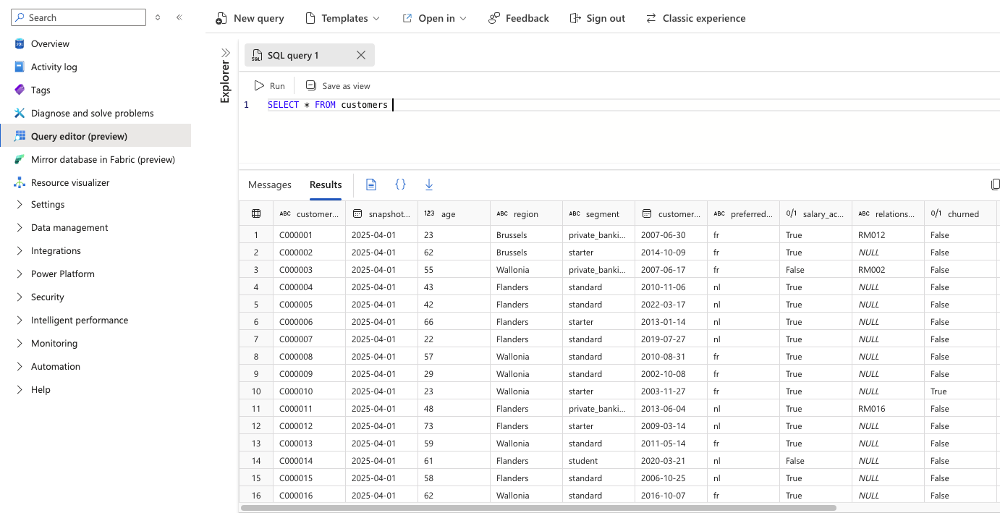
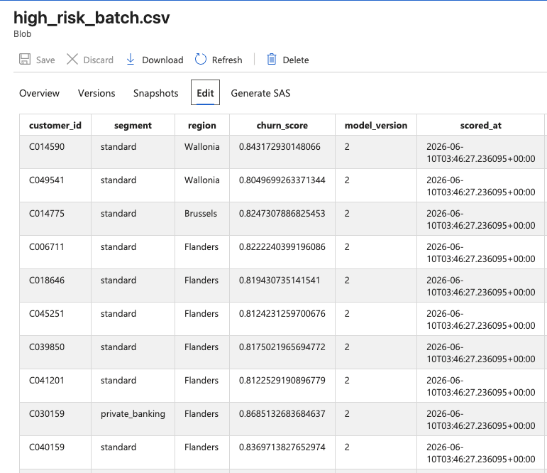

# BankRetain

## Customer Churn Predictor & AI-Driven Retention Campaign Orchestrator

End-to-end MLOps and GenAI portfolio project on Azure — built for the AI-103 (Developing AI Apps and Agents on Azure) and AI-300 (Operationalizing Machine Learning and Generative AI Solutions) certification exams. Covers the full lifecycle from synthetic data generation through ML model training, agent-based campaign generation, compliance review, and a live Streamlit dashboard.

**Live dashboard:** [bankretain.streamlit.app](https://bankretain.streamlit.app)

---

## What it does

1. **Churn prediction** — a LightGBM model trained on 50,000 synthetic Belgian retail banking customers identifies the ~800 highest-risk customers each week (threshold: churn probability ≥ 0.70).

2. **Customer enrichment** — an Azure ML pipeline builds rich AI Search profile documents for every high-risk customer (transaction history, complaints, product holdings, app engagement).

3. **Three-agent retention pipeline** — for each high-risk customer, three sequential AI agents:
   - **Agent 1** classifies the churn reason (`price_sensitivity`, `service_dissatisfaction`, `product_lifecycle`, `inactivity`)
   - **Agent 2** selects a matching retention offer from 25 product offers and drafts an outreach message (email or call script)
   - **Agent 3** evaluates the draft against 21 compliance rules — any hard-block violation routes the message to human review

4. **Analytics dashboard** — 5-page Streamlit app showing population statistics, ML model metrics, approved messages, compliance review queue (with human override), and pipeline analytics.

---

## Architecture

```text
Azure SQL (50k synthetic customers)
        │
        ▼
Azure ML Pipeline ──► Feature Store ──► LightGBM Churn Model
        │                                       │
        ▼                                       ▼
  Batch Scoring                      high_risk_batch.csv
  (~800 high-risk customers)                    │
                                                ▼
                                Azure AI Search (customer profiles)
                                                │
                          ┌─────────────────────┼──────────────────────┐
                          ▼                     ▼                      ▼
                      Agent 1               Agent 2               Agent 3
                   Churn Classifier      Offer Selector       Compliance Review
                   (gpt-oss-120b +       (gpt-oss-120b +      (gpt-oss-120b +
                    AI Search tool)       inline catalogue)     inline rules)
                          └─────────────────────┼──────────────────────┘
                                                │
                          ┌─────────────────────┴──────────────────────┐
                          ▼                                             ▼
                 approved_outreach                         compliance_review_queue
                   (Azure SQL)                                 (Azure SQL)
                          │                                             │
                          └──────────────────┬──────────────────────────┘
                                             ▼
                                  Azure Blob Storage
                                  (dashboard-cache/*.parquet)
                                             │
                                             ▼
                                  Streamlit Dashboard
                                  (bankretain.streamlit.app)
```

---

## Repository structure

```text
bankretain/
├── infra/
│   ├── ml-rg/          # Bicep — Azure ML workspace, SQL, Storage, Key Vault, RBAC
│   └── ai-rg/          # Bicep — AI Foundry hub/project, AI Services, AI Search, RBAC
├── data/
│   ├── synthetic/      # Population A & B generators, churn label logic, SQL seeder
│   ├── product_catalogue/products.md   # 25 retention offers (PR-001–PR-025)
│   └── compliance_rules/rules.md       # 21 compliance rules (BT, FSMA, MiFID, PERS, CH)
├── ml/
│   ├── features/       # Azure ML feature store definitions and pipeline
│   ├── training/       # LightGBM train/evaluate scripts, AML pipeline definition
│   ├── scoring/        # Batch scoring, enrichment pipeline, online scoring script
│   ├── monitoring/     # Drift monitor, Event Grid alert trigger
│   └── registry/       # Model promotion script (staging → production)
├── agents/
│   ├── prompts/        # System prompts for all three agents
│   ├── tools/          # AI Search tool for Agent 1, JSON schemas
│   ├── orchestration/pipeline.py   # End-to-end sequential agent runner
│   ├── vector_stores/  # upload_products.py, upload_compliance.py (kept for reference)
│   └── evaluation/reference_outputs/   # 30 manually verified reference messages
├── dashboard/
│   ├── app.py          # Streamlit entry point
│   ├── blob_store.py   # All dashboard reads (Parquet from Azure Blob, no ODBC)
│   ├── config.py       # Bootstraps env vars from st.secrets; ODBC driver extractor
│   ├── db.py           # Legacy SQL helper (kept; used by queue write-backs)
│   ├── state/queue_store.py   # Human review write-backs to Azure SQL
│   └── pages/
│       ├── 01_data_overview.py
│       ├── 02_ml_monitoring.py
│       ├── 03_approved_outreach.py
│       ├── 04_review_queue.py
│       └── 05_pipeline_analytics.py
└── .github/workflows/
    ├── deploy-infra.yml    # Bicep CI/CD (OIDC, no stored secrets)
    └── retrain.yml         # Drift-triggered retraining pipeline
```

---

## Tech stack

| Layer | Technology |
| --- | --- |
| Infrastructure as Code | Azure Bicep + GitHub Actions (OIDC) |
| Database | Azure SQL (Entra-only auth, no passwords) |
| ML platform | Azure Machine Learning — managed feature store, serverless compute, model registry |
| ML model | LightGBM (GBM binary classifier), MLflow tracking |
| Vector search | Azure AI Search — customer profile index |
| LLM | `gpt-oss-120b` via Azure AI Services (AIServices quota pool) |
| Embeddings | `text-embedding-3-large` via Azure AI Services |
| Agent framework | Azure AI Foundry Responses API |
| Blob storage | Azure Blob Storage — batch CSV, Parquet dashboard cache |
| Auth | User-assigned Managed Identity + DefaultAzureCredential throughout |
| Secrets | Azure Key Vault (Search key, no inline credentials anywhere) |
| Dashboard | Streamlit Community Cloud |

---

## Prerequisites

- Azure subscription with contributor access
- Azure CLI (`az login`)
- Python 3.9+
- GitHub repository with the following secrets:
  - `AZURE_CLIENT_ID`, `AZURE_TENANT_ID`, `AZURE_SUBSCRIPTION_ID` — GitHub Actions OIDC SP
  - `AZURE_RESOURCE_GROUP_ML`, `AZURE_RESOURCE_GROUP_AI` — target resource groups

---

## Setup

### 1. Provision infrastructure

Push to `infra/` or trigger `deploy-infra.yml` manually. This deploys both resource groups via Bicep and sets all RBAC assignments as code.

```bash
git push  # triggers deploy-infra.yml if infra/ files changed
```

### 2. Generate and seed synthetic data

```bash
# Set up local SQL credentials (gitignored)
cp sql.env.example sql.env
# Edit sql.env with your SQL server name and Entra credentials

source sql.env
cd data/synthetic
pip install -r ../../requirements.txt
python generate.py --population a --seed-sql
python generate.py --population b       # local only, no SQL
```



### 3. Run the ML pipeline

```bash
# Feature pipeline
python ml/features/feature_pipeline.py

# Training pipeline
python ml/training/pipeline.py

# Batch scoring
python ml/scoring/submit_batch_score.py
```




### 4. Run the enrichment pipeline

```bash
# Populates Azure AI Search with high-risk customer profiles
python ml/scoring/submit_enrichment.py
```

### 5. Run the agent pipeline

```bash
source sql.env
python agents/orchestration/pipeline.py \
    --search-endpoint  https://<your-search>.search.windows.net \
    --keyvault-name    <your-kv-name> \
    --storage-account  <your-storage-account> \
    --batch-size       20      # omit for full batch
```

This writes results to Azure SQL and uploads 5 Parquet files to the `dashboard-cache` blob container.

### 6. Run the dashboard locally

```bash
source sql.env
streamlit run dashboard/app.py
```

---

## Streamlit Community Cloud deployment

The dashboard is deployed at [bankretain.streamlit.app](https://bankretain.streamlit.app).

Required secrets in Streamlit settings:

```toml
AZURE_CLIENT_ID     = "<bankretain-dashboard-sp app id>"
AZURE_CLIENT_SECRET = "<sp secret>"
AZURE_TENANT_ID     = "<tenant id>"
AZURE_STORAGE_ACCOUNT = "bankretainstdevmqi4i4pj"

BANKRETAIN_SQL_SERVER = "<server>.database.windows.net"
BANKRETAIN_SQL_DB     = "bankretaindb"
```

The dashboard reads all data from Azure Blob Storage Parquet files — no ODBC driver is needed on page load. The Microsoft ODBC Driver 18 is extracted lazily via `dpkg -x` (no root) only when a human reviewer submits a decision on page 04.

---

## Key architectural decisions

### gpt-oss-120b instead of gpt-4.1


This Azure subscription's policy restricts deployments to five regions: `spaincentral`, `uaenorth`, `italynorth`, `germanywestcentral`, `switzerlandnorth`. None of these had OpenAI.GlobalStandard quota for the GPT-4 model family at the time of deployment. `gpt-oss-120b` (format `OpenAI-OSS`) is available via the AIServices quota pool (5000K TPM) in `germanywestcentral` and supports the same chat completions API and structured JSON output.

### Inline knowledge injection instead of file_search

`gpt-oss-120b` uses format `OpenAI-OSS` and does not support the `file_search` tool. `products.md` (~18 KB) and `rules.md` (~13 KB) are small enough to fit in the context window and are injected directly into the Agent 2 and Agent 3 system prompts in `pipeline.py`. `upload_products.py` and `upload_compliance.py` are retained in the repo as reference implementations for when a file_search-capable model becomes available in the allowed regions.

### Blob Parquet cache for the dashboard

Streamlit Community Cloud runs as a non-privileged user with no passwordless sudo. The Microsoft ODBC Driver 18 cannot be installed via `apt`. All dashboard page-load reads were migrated to Azure Blob Storage Parquet files (written by the pipeline after each run, 5-minute TTL cache). The `azure-storage-blob` SDK is pure Python and needs no OS-level driver. The ODBC driver is still needed for the human review write-back on page 04; `config.py` extracts it via `dpkg -x` to `~/.msodbcsql18` without root on first use.

### Entra-only SQL authentication

Azure SQL is configured with Entra-only authentication — there is no SQL username or password. Connections use an Azure AD access token obtained from `DefaultAzureCredential` and struct-packed into the pyodbc `attrs_before={1256: token_struct}` attribute. `pymssql` was evaluated and rejected because it does not accept an `access_token` keyword argument.

### Zero secrets in code

No API keys, connection strings, or client secrets appear in any code file. All secrets flow through:

- Azure Key Vault (AI Search admin key, retrieved at runtime via Managed Identity)
- `st.secrets` → `os.environ` (Streamlit dashboard, bootstrapped by `config.py`)
- `sql.env` (local dev only, gitignored)
- GitHub Actions OIDC (no stored client secret for the CI/CD SP)

---

## Security constraints (permanent)

- Azure SQL uses Entra-only authentication — no SQL username or password exists
- `USE_MANAGED_IDENTITY=true` in all pipeline runs
- GitHub Actions authenticates via OIDC — no stored client secret
- `sql.env` is gitignored — never commit
- No API keys or connection strings in any code file

---

Last updated: June 2026
